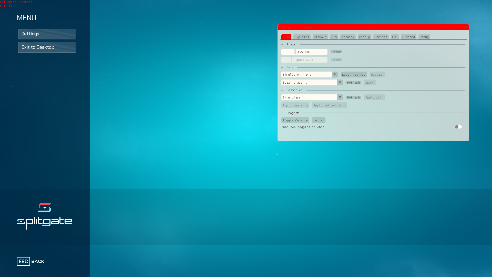
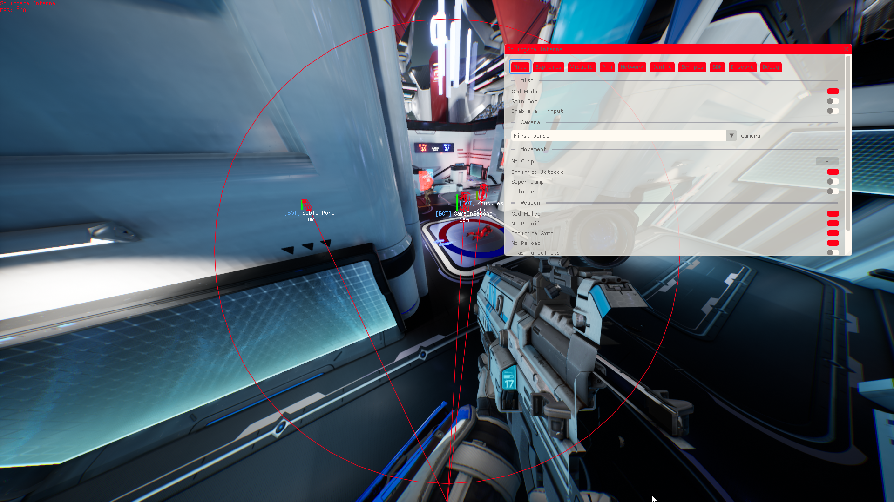

# Launcher
🚀 Custom Splitgate launcher and ingame-dll coded in cpp

## Preview

<table>
  <tr>
    <td></td>
    <td></td>
  </tr>
</table>

## Usage
  • Build the project or download the latest precompiled binaries from [here](https://nightly.link/SplitgateDevelopment/Launcher/workflows/msbuild/master/Release.zip)

  • Make sure Launcher.exe and Internal.dll in the same folder

  • Have a Python 3.x installed (the same version the DLL was built against — e.g. `python314.dll`
    for a Python 3.14 build). The embedded interpreter loads it from the install and finds its
    standard library there. Do **not** copy `python3XY.dll` next to `Internal.dll` or into the game
    folder — that makes Python look for its stdlib in the wrong place ("Could not find platform
    independent libraries").

  • Start the game
  
  • Open Launcher.exe
  
  • Use the `Ins` button to show/hide the gui

## Compile
To compile the project make sure you have [Visual Studio 22](https://visualstudio.microsoft.com/en/downloads/), [vcpkg](https://vcpkg.io/en/getting-started) integrated with `MSBuild` and any [Python](https://www.python.org/downloads/) 3.x installed

> [!IMPORTANT]
> `Internal` embeds Python (via pybind11 + `<Python.h>`), so a Python 3.x installation is required to compile.

`Internal/python.props` auto-detects the newest 64-bit Python installed under `C:\Python3XY` or recorded by the official installer in the registry (which covers per-user and all-user installs in any folder) — no configuration needed for a default install. `Internal` is an x64 build, so a 64-bit Python is required.

If Python is installed somewhere custom that isn't picked up, set the `SPLITGATE_PYTHON_DIR` environment variable to your Python root (the folder containing `include\` and `libs\`), or pass `/p:PythonRoot=<dir>` to MSBuild. Whichever version is selected must match the `python3XY.dll` present at runtime.

- Install `Internal` dependencies:
  ```sh
  cd Internal
  vcpkg install
  ```
- Compile using Visual Studio

## Documentation

- [Settings](docs/settings.md) — configuration structs, persistence, file location
- [Features](docs/features.md) — the feature framework and how to add one
- [Hooking](docs/hooking.md) — injection and how the game's functions are hooked
- [Debugging](docs/debugging.md) — reading logs, the in-game console, and crash stack traces
- [Game dump](docs/game-dump.md) — the Dumpspace SDK dump for Splitgate (offsets, JSON schema)
- [Backend redirect](docs/backend-redirect.md) — routing the game to a private server (+ [early injection](docs/early-injection.md))
- [Scripting](docs/scripting.md) — embedding Python and writing user scripts
- [Testing](docs/testing.md) — the gtest project and how to run it
- [Style & linting](docs/style.md) — clang-format / clang-tidy setup
- [UE4 cheatsheet](docs/ue4-cheatsheet.md) — living RE reference: key objects, offsets, and snippets
