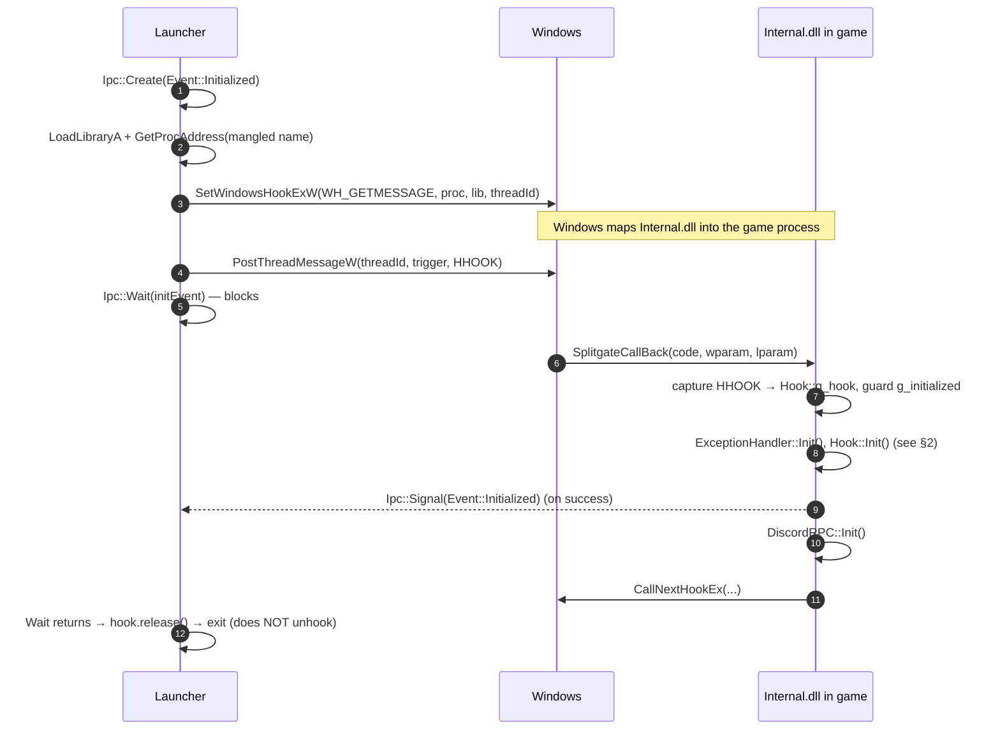
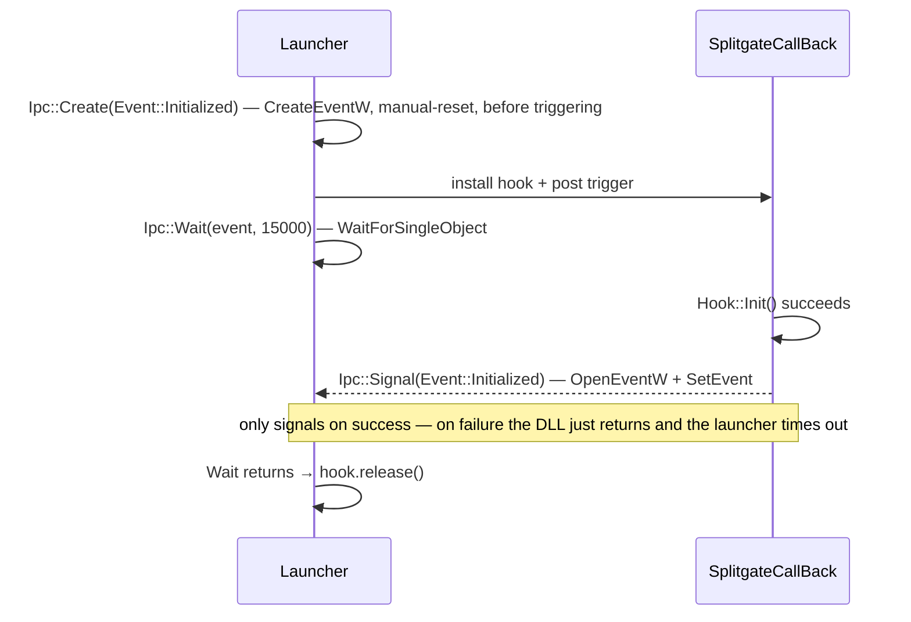

# Hooking & injection

How `Internal.dll` gets running inside Splitgate and how it intercepts the game's
functions. Everything here lives in `Internal/hook/` (`Hook.h` and `hook/functions/`),
plus the launcher and `dllmain.cpp` on the injection side.

There are two distinct layers, and it helps to keep them separate:

1. **Injection** — getting our code executing inside the game process at all.
2. **Function hooking** — once we're in, intercepting specific engine functions so our
   code runs on every frame and every gameplay event.

---

## 1. Injection — the `SetWindowsHookEx` technique

The launcher never writes to the game's memory directly. Instead it uses a stock Win32
mechanism that makes Windows load our DLL into the target for us: a **thread-local
`WH_GETMESSAGE` hook**.

### Flow



Key points:

- **Why `WH_GETMESSAGE`.** Installing a thread-specific hook on the game's UI thread forces
  Windows to load the hook's DLL (`Internal.dll`) into the game process and call the hook
  proc there. That proc (`SplitgateCallBack`) is our foothold — it runs *in the game*.
- **The trigger message.** The hook proc only fires when the target thread pulls a message
  from its queue, so the launcher `PostThreadMessageW`s one to kick it off. The message id is
  just a private signal we agree on; it must match on both sides (see the *trigger message*
  note below).
- **Handing off the `HHOOK`.** `SetWindowsHookExW` returns the handle in the *launcher*, but
  the *DLL* is what tears everything down later. So the launcher passes the handle in the
  message's `lParam`, and the callback stores it in `Hook::g_hook`. Without this, the handle
  is lost and `UnhookWindowsHookEx` at unload can't work.
- **The launcher does not unhook.** Removing the hook could unload the DLL, so the launcher
  installs it and exits; the DLL owns cleanup in `Hook::UnHook()`. (What actually keeps the
  module resident after the launcher exits is the DLL's own running threads, not the hook.)
- **`CallNextHookEx`'s first argument is ignored by Windows**, so it doesn't matter that
  `g_hook` may still be null the first time through — the handle only matters for the
  eventual `UnhookWindowsHookEx`.
- **Re-entry guard.** The proc runs for *every* retrieved message, so `Hook::g_initialized`
  ensures `Hook::Init()` runs exactly once.

### Initialization handshake

Posting the trigger message only means the message was queued — not that the DLL initialized.
So instead of the launcher guessing with a fixed sleep, the two sides shake hands over a
**named Win32 event** (see [shared/Ipc.h](../shared/Ipc.h)):



- The event lives in the `Local\` namespace (both processes share one user session) and is
  **manual-reset**, so there's no lost-wakeup race if the DLL signals before the launcher
  reaches `Wait`.
- The DLL calls `Ipc::Signal` **only after `Hook::Init()` succeeds**; the callback early-returns
  on failure without signaling, so a failed init surfaces to the launcher as a timeout rather
  than a false "injected" success.
- The `Ipc::Event` enum is the single source of truth for the event name across both
  processes — neither side hard-codes the string, and adding another handshake (e.g.
  `Event::ScriptsLoaded`) is a one-line change. This is separate from the in-game event bus
  in [scripting.md](scripting.md), which dispatches *inside* the game.

### Ownership via RAII

The launcher's Win32 resources are wrapped in move-only RAII types (`UniqueLibrary`,
`UniqueHook`, `UniqueHandle` in `Launcher/utils/handles/`) so every failure path cleans up
without a manual ladder. The hook is the interesting one: on any failure the `UniqueHook`
destructor calls `UnhookWindowsHookEx` (init never completed, so removing the hook is
correct), but after a **successful** handshake the launcher calls `hook.release()` to give up
ownership *without* unhooking — the DLL now owns it via `Hook::g_hook`. (Freeing the
launcher's own `UniqueLibrary` on exit only unloads the launcher's mapping of the DLL, not the
copy injected into the game.)

### The exported callback signature

`SplitgateCallBack` is a standard Win32 hook procedure:

```cpp
LRESULT CALLBACK SplitgateCallBack(int code, WPARAM wparam, LPARAM lparam);
```

Per the `WH_GETMESSAGE` contract:

- `code` — `HC_ACTION` (`0`) or a negative value. If `code < 0`, the proc must pass straight
  to `CallNextHookEx` **without** touching `lparam`.
- `wparam` — `PM_REMOVE` / `PM_NOREMOVE`.
- `lparam` — a pointer to the retrieved `MSG` (valid to dereference only when `code >= 0`).
  The launcher's posted values arrive as `msg->message` (our trigger id) and `msg->lParam`
  (the `HHOOK`).

Because the function is **not** `extern "C"`, the symbol in the DLL's export table is the
MSVC C++-mangled name, and the launcher resolves that exact string:

```
?SplitgateCallBack@@YA_JH_K_J@Z
```

Decoded (x64):

| Token | Meaning |
|-------|---------|
| `?` | start of a C++ decorated name |
| `SplitgateCallBack` | the function name |
| `@@` | no enclosing class/namespace → a free function |
| `Y` | ordinary (non-member) function |
| `A` | calling convention `__cdecl` (on x64 all conventions collapse to one, so `CALLBACK` → `A`) |
| `_J` | return type `__int64` — i.e. `LRESULT` (`LONG_PTR`) on x64 |
| `H` | param 1 `int` (`code`) |
| `_K` | param 2 `unsigned __int64` — `WPARAM` (`UINT_PTR`) on x64 |
| `_J` | param 3 `__int64` — `LPARAM` (`LONG_PTR`) on x64 |
| `@Z` | end of parameter list / function marker |

So the string encodes `__int64 __cdecl SplitgateCallBack(int, unsigned __int64, __int64)`.

> [!WARNING]
> This decorated name is tied to the exact signature **and** to x64. Changing a parameter
> type, the calling convention, or wrapping the function in a namespace changes the mangled
> name and silently breaks the launcher's `GetProcAddress` (it returns null → injection
> fails). For a stable export, use `extern "C"` or a `.def` `EXPORTS` entry so the launcher
> can resolve a plain `SplitgateCallBack`.

### Trigger message id

The launcher and DLL must agree on the message id. The project uses:

```cpp
UINT msg = RegisterWindowMessageW(L"SplitgateInit");
```

The system returns a session-unique id (range `0xC000–0xFFFF`), and the **same string yields
the same number in every process** — so the launcher and the DLL each call
`RegisterWindowMessageW(L"SplitgateInit")` and independently get the identical value, with no
shared constant to keep in sync and no chance of colliding with an unrelated message. This
matters here because the message is posted to the game's UI thread, which we don't own. The
returned value is a runtime `UINT` (not a `constexpr`), so store it and compare
`msg->message == id` — fine for a one-shot bootstrap signal.

> A simpler alternative is a private constant `WM_APP + n` (range `0x8000–0xBFFF`), but it
> must be kept identical in both files and isn't collision-proof on a thread we don't own.
>
> Historically the code reused `HCBT_CREATEWND` as the trigger id. That value is `3`, which
> is also `WM_MOVE` — a real (if rarely-hit, since `WM_MOVE` is usually *sent*, not *posted*)
> collision. `RegisterWindowMessageW` replaces it.

---

## 2. Function hooking — `Hook::Init()`

Once we're executing inside the game, `Hook::Init()` (in `Hook.h`) wires our code into the
engine. It walks the Unreal object graph to find the objects it needs, captures two
**vtables**, and installs two hooks — one per technique:

```
World → OwningGameInstance → LocalPlayers[0] (UPortalWarsLocalPlayer)
      → ViewportClient → VFTable            ── PostRender vtable
UObject::GetDefaultObj() vtable             ── ProcessEvent vtable
```

### `SetHook` — manual vtable swap

`Hook::SetHook(void** vtable, int index, void* target)` overwrites a single entry in a
vtable with our function pointer and returns the original pointer so we can both call through
to it and restore it later. This is the lightweight technique used for **`PostRender`**:

```cpp
PostRender::Original = SetHook(PostRender::VTable, PostRender::Index, &PostRender::HookedPostRender);
// ... and on teardown:
SetHook(PostRender::VTable, PostRender::Index, PostRender::Original);
```

### MinHook — trampoline hook

For **`ProcessEvent`** the code uses [MinHook](https://github.com/TsudaKageyu/minhook), which
installs a trampoline by patching the target function's prologue (rather than swapping a
vtable slot). `Init()` resolves the real function from the `UObject` vtable, then:

```cpp
MH_Initialize();
MH_CreateHook(target, &ProcessEvent::HookedProcessEvent, &ProcessEvent::Original);
MH_EnableHook(MH_ALL_HOOKS);
```

`ProcessEvent::Original` is the trampoline used to call the game's real implementation.

### The two hooked functions

Both live in `hook/functions/`:

- **`PostRender`** — the game calls this once per rendered frame on the viewport client. Our
  hook is the per-frame heartbeat: it renders the ImGui menu and runs the render-loop
  features via `Features::Execute()`, then calls the original. This is why anything drawn
  on screen (ESP, radar, the menu) is driven from here.
- **`ProcessEvent`** — the funnel through which Unreal dispatches virtually every `UFunction`
  call (Blueprint events, gameplay callbacks, etc.). Our hook inspects the `UFunction` being
  called and, when it matches an entry in its table, dispatches the corresponding
  `Events::Type` on the [event bus](scripting.md) (e.g. shutdown). Then it calls the original
  so the game behaves normally. This is how features run on gameplay events instead of
  polling every frame.

See [features.md](features.md) for how features subscribe to `Render` vs. specific events,
and [scripting.md](scripting.md) for the event bus itself.

---

## 3. Teardown — `Hook::UnHook()`

On unload the DLL reverses everything, in order:

1. `MH_DisableHook(MH_ALL_HOOKS)` + `MH_Uninitialize()` — remove the MinHook trampolines.
2. `SetHook(...)` with the saved original — restore the `PostRender` vtable entry.
3. Destroy the console, disable the exception handler, destroy the GUI.
4. `UnhookWindowsHookEx(Hook::g_hook)` — remove the injection hook (guarded so it only runs
   when the handle was actually captured; see §1).

### Injection-state globals

`Hook::g_hook` and `Hook::g_initialized` (both declared in `Hook.h`) hold the injection
state. They're declared **`inline`** so the header can define them safely even if it's ever
included in more than one translation unit — the correct C++17 idiom for a header-scope
global, and zero-cost.
